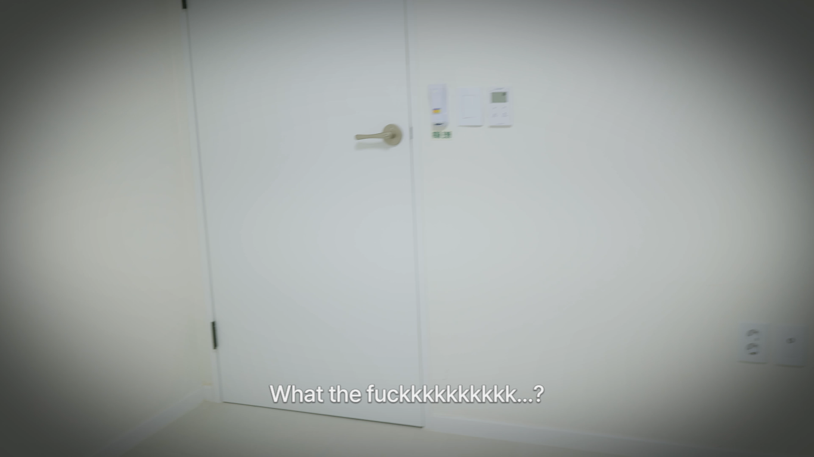

<div align="center">
  <h1>Five Hearts Translation</h1>
  <p>What is this? It's a <a href="https://github.com/LavaGang/MelonLoader">MelonLoader</a> MOD for <a href="https://store.steampowered.com/app/3021100/Five_Hearts_Under_One_Roof/">Five Hearts Under One Roof</a> game.
  <br/>
  With this you can patch the game UI text and subtitles. This MOD is solely created to fix the bad translation, but maybe in not so long future I'll add the functionality to add a new language.</p>
  
</div>

## How To Use

- Download [MelonLoader Installer](https://github.com/LavaGang/MelonLoader.Installer/releases). Run the app and add the game executable to install the MelonLoader.
- Download the MOD on [Releases](https://github.com/kiraio-moe/FiveHeartsTranslation/releases). Extract and place it on `[Game Directory]/Mods/`.

### Dumping Game Text Assets

- Run the game.
- Press `Home` key to toggle the MOD menu.
- Click `Dump Game Text` to dump the assets.
- Wait until all assets dumped (See the Console). Dumped assets located in `[Game Directory]/Mods/FiveHeartsTranslation/Dumps/TextAsset/`.
- **WARNING**: Place your translation work on another directory! If you dump the assets again, it will overwrite your hours of work!

### Patching Game Text Assets

- Close the game.
- Copy patched assets to `[Game Directory]/Mods/FiveHeartsTranslation/Patches/TextAsset/`.
- **NOTE**: Don't rename the assets name or it's extension! Leave it as it is or it will not be loaded at runtime.

## How to Build

- Change the game directory in `.csproj` file.
- Build (Release):

  ```bash
  dotnet build -c Release
  ```
